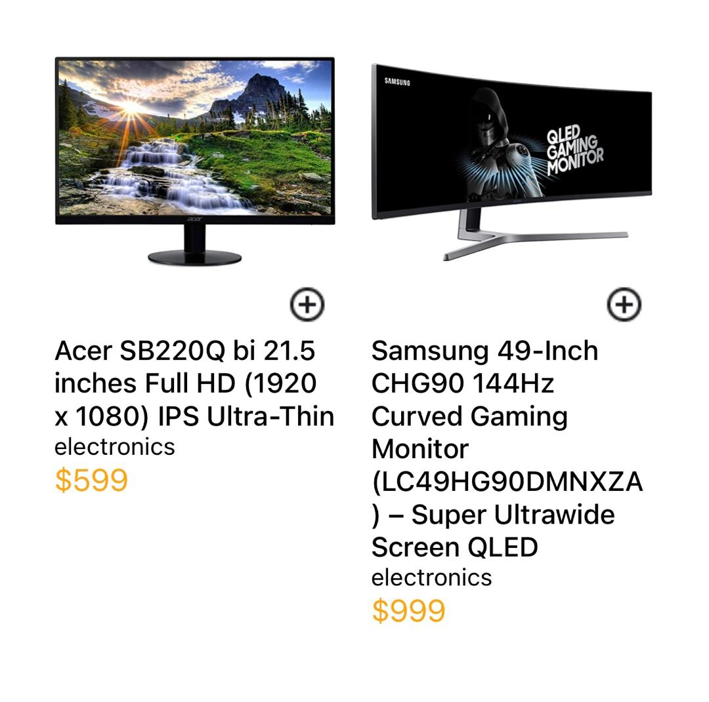
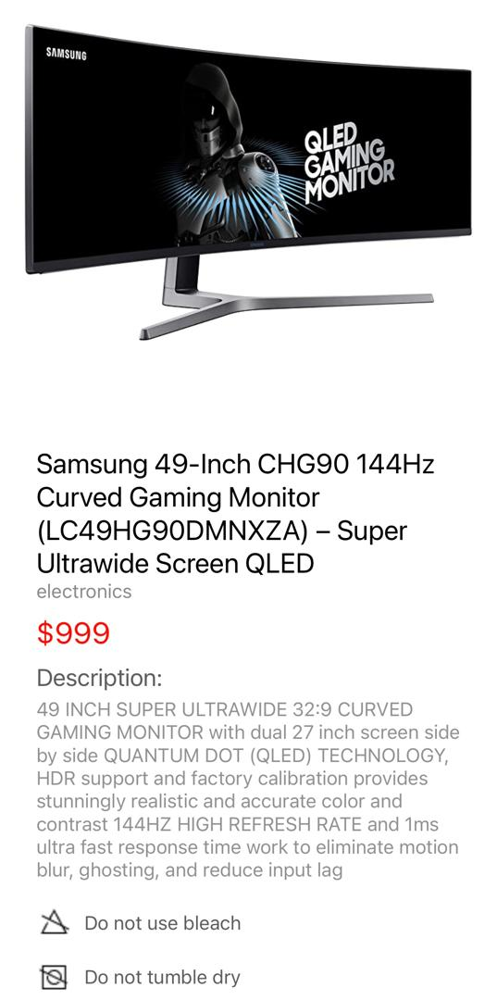
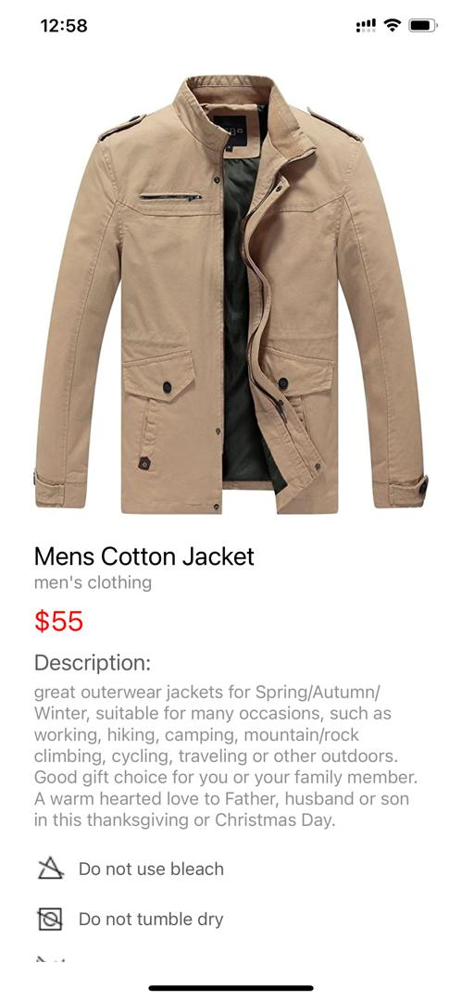

# rn-assignment7-11358166
THIS IS A DETAILED README OF MY DESIGN CHOICES AND HOW DATA STORAGE WAS IMPLEMENTED

1. The screen uses a SafeAreaView for ensuring content displays within safe margins, particularly on devices with notches or safe areas.
2. Header: Includes navigation controls such as a menu icon for drawer navigation, app logo for branding, search icon for functionality, and a shopping bag icon to navigate to the checkout screen.
3. Main Content: Displays a list of products fetched from a remote API using a FlatList component. Each product is presented in a grid layout with two columns.
Product Item: Each product item includes an image, title, category, and price. Users can click on the image to navigate to a detailed product screen or use the "Add to Cart" button represented by an icon in the corner of the image.
4. Items in the cart are displayed in a vertical list format, with appropriate spacing and alignment for readability.
5. Text styles are chosen to maintain a clean and consistent aesthetic, with emphasis on price.
6. Interaction: Users can seamlessly navigate between screens using React Navigation's hooks (useNavigation) and components (Pressable for touchable areas). Clicking on a product image navigates the user to the detailed product screen, while clicking on the shopping bag icon navigates to the checkout screen.
7. Product Image: Displays the product image in a container with a maximum height of 400 pixels, ensuring it maintains aspect ratio and clarity.
8. Product Details: Presents product title, category, price, and description fetched dynamically from the API.
9. Care Instructions: Displays care instructions with icons and corresponding text for clarity on product care.
10. Shipping Information: Provides shipping details such as shipping method, estimated delivery date, and a visual indicator for delivery status.
11. Utilizes FontAwesome and AntDesign icons for visual representation of actions like adding to basket and marking as favorite.
12. Care instructions and shipping information include iconography to visually enhance information clarity and user experience.
13. Implements ScrollView to allow users to scroll through product details seamlessly, even on smaller screens.

14. Functional Components:
handleAddToCart Function: Checks if the selected item is already in the cart (Cart). If not, it adds the item to the temporary cart (tempCart) and updates AsyncStorage with the latest cart data. This function ensures a smooth and efficient user experience when adding items to the shopping cart.
Overall, the Home Screen is designed to provide a user-friendly shopping experience with intuitive navigation, clear product presentation, and seamless data management using AsyncStorage for persistent cart storage.
Add to Basket Button: Positioned at the bottom of the screen within a fixed footer. Allows users to add the product to their shopping cart with a "+" icon and text.
Favorite Button: Includes a heart-shaped icon for adding the product to favorites, enhancing user engagement and wishlist functionality.

15. DATA MANAGEMENT:
AsyncStorage: Used for persistent storage of the shopping cart (Cart). When a user adds an item to the cart (handleAddToCart function), the temporary cart (tempCart) is updated and then stored in AsyncStorage. This ensures that cart items are retained across app sessions.
API Integration: Fetches product data from the "https://fakestoreapi.com/products?limit=20" endpoint upon component mount. This populates the data state with product information that is then displayed in the FlatList.

16. THE SCREENSHOTS OF THE APP CAN BE FOUND BELOW:

